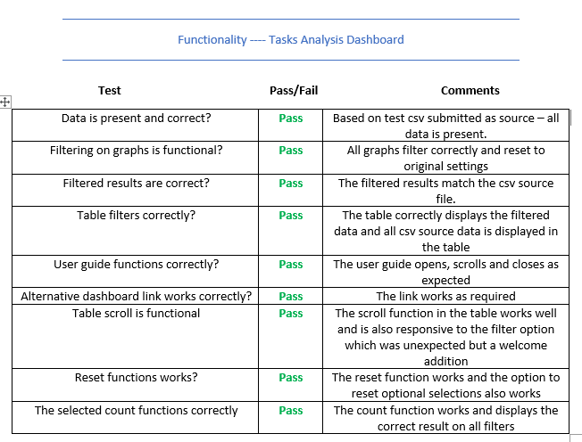

# STAFF ANALYSIS DASHBOARDS

This site contains dashboards to provide detailed analysis of team data for work & time permitting the users to filter data displays as required.
There are 2 dashboards in the site, the first graphs staff records filtering by work completed and also contains a filtered table for better visualisation.
The 2nd page provides analysis of the time utilised for the recorded tasks.

The intention of the design and development is to meet requirements of management and move the team to a more automated analysis work style,
enabling users to run analysis on demand without the requirement to export data to other systems or manually create graphical representations
of data when required.

The dashboards can be run by clicking [here](https://mofarrell1967.github.io/Staff-Analysis-Dashboards/)

# UX

The design scope was created from the request by management and team members to provide a better method of viewing task & time details than is currently employed by the team.

The first requirement was to evaluate the current method of analysis employed and to then design dashboards to replicate and improve where possible.
The manager and team were engaged to relate their existing limitations and then provide a detailed scope for the development of the dashboards.

The current method of analysis requires the data to be exported from our Sharepoint repository and inserted in an Excel spreadsheet so that graphs and
tables can be enabled to display the required data.

## User Stories

### Manager

As a manager I need to have details on hand to show what
tasks have been completed by my team over particular reporting
periods and also to be able to evaluate the number of hours
taken up in the completion of these tasks.

As the team work across multiple platforms covering a variety
of work types and priorities, it is invaluable to have up to
date records of this work in a form that is easy to
understand and to be able to drill down on.

During staff reviews or work scheduling it would be a great
advantage to have the latest data available for analysis or
presentation to others and the dashboard design is seen as
the best solution to my issues.

The current method is very time consuming and requires exports
to be constantly updated with the latest data which is not ideal
when working in such a time sensitive environment and the need to
be able to re-classify work priorities or distribute new tasks
appropriately will result in better work conditions for the staff
and provide me with the necessary data on hand to be able to
manage our task load in a more efficent manner.

### Team User

The current practice of storing all details of the tasks on the team
Sharepoint site is fine but it lacks the capability of viewing the
stored data in a way that shows team members details of their work
or provides any breakdown in graphical form.

The design of the dashboards is a welcome addition of reporting
intelligence to our data storage area and the filtering functionality
will allow users to be able to drill into specific elements of our work
loads and divisions of time. To be able to see at a glance how many
hours we spend on admin tasks over projects would be a useful support
tool when pushing management for less admin and more remedial work.

In the environment today we are always updating the Sharepoint folder
with our activities only to have to export the entire file when asked
for any type of breakdown to discuss at team meetings or work reviews.
The development of the html dashboard will allow this to be run during
these meetings in the knowledge that the data is current and only
the required information can be displayed at any time.

## UX based design

On the back of the user stories and verbal requirements it was agreed that the team would develop a Statement of Requirements to clearly call out what the
expectations for the dasboards and detail all specific requirements before commencing the development process.

It was also set down that the testing methodology would remain in line with current team processes and all testing would follow a manual schedule of testing the layout
& presentation of the dashboards and the functionality of content and formula.

The Scope of Requirements can be viewed [here](assets/documents/dashboard_scope.pdf) and the testing results and comments are recorded from page 5 of the document.

Further testing was completed during development based on the known results in the sample csv source file to ensure all results were the same as those in the source
file and any filters or selections provided the same correct results as those manually calculated from this source file csv.

# FEATURES

Task Analysis Dashboard

The features enabled on the Task Dashboard are;

1.  Row Graphs for the 'Name', 'Worktype', 'Priority' & 'Platform' fields
2.  A table showing "name", "date", "worktype", "platform", "duration", "priority", "id", "zone"
3.  A mouse click on any graph bar will apply a filter to show the data for the selections
4.  Multiple selections can be applied and the filter will then apply to the selection range
5.  A 'reset' button has been added to the page to clear the filtering and user can also unfilter single selections also
6.  A User Guide Modal is available with instructions for using the dashboard
7.  The table will automatically filter the records display based on what filtering has been applied to the graphs
8.  a link to the Time Analysis Dashboard is also enabled on the screen for quick and easy transition to the alternative analysis page

### Task Analysis Dashboard Wireframe

The Task Analysis Page Mockups can be viewed [here](assets/documents/mockups/task.dashboard.mockup.pdf)

Task Analysis Dashboard

The features enabled on the Time Dashboard are;

1.  Row Graphs for the 'Name', 'Worktype', 'Priority' & 'Platform' fields
2.  A line graph displaying the hours over a 'months' axis
3.  A mouse click on any graph bar will apply a filter to show the data for the selections
4.  Multiple selections can be applied and the filter will then apply to the selection range
5.  A 'reset' button has been added to the page to clear the filtering and user can also unfilter single selections also
6.  A User Guide Modal is available with instructions for using the dashboard
7.  The line graph will automatically filter based on graph selections and can also be filtered using mouse-click-drag-release (brush)
8.  a link to the Time Analysis Dashboard is also enabled on the screen for quick and easy transition to the alternative analysis page

### Time Analysis Dashboard Wireframe

The Time Analysis Page Mockups can be viewed [here](assets/documents/mockups/time.dashboard.mockup.pdf)

## Future Release & development

Phase 2

•	A Google API will be applied to an existing or additional page and will display the ‘Zone’ data.

•	The pages will be opened for use beyond the internal team members and the company access warning page will be applied as the index.
    The current index page will be renamed to task.html and an additional link added to the pages.

•	Additional graphical displays to provide summary data for senior management will be scoped and developed as part of the Phase 2 rollout.

Phase 3

•	Development of similar analysis pages will be offered to additional teams in the company and, if required,
    will be scoped and developed as part of the Phase 3 rollout.

•	In Phase 3, the pages will be migrated from the internal Sharepoint site to a central html location for access by the company staff and management.

# TECHNOLOGIES

*   [Bootstrap](https://www.getbootstrap.com/) - For HTML and CSS design, layout & Styles
*   [Javascipt](https://www.javascript.com/) -   To create graphical functionality
*   [Crossfiler](https://square.github.io/crossfilter/) -   To enable filtering of graphical data
*   [D3](https://d3js.org/) -   To provide data driven manipulation of the document
*   [DC](https://dc-js.github.io/dc.js/) -   To support the interactive chart development in Javascript and additional css styles
*   [JQUERY](https://www.jquery.com/) -   To support the Modal development for the pages
*   [POPPER](https://popper.js.org/) -   To support the Modal development for the pages

# TESTING

The testing methodology was agreed by the team and based on manual process covering agreed criteria.

The first element of testing covered the layout and presentation of the pages to ensure they met the requirements set out
in the scope and satisfied the expectations of the user base.

Each element was reviewed by the testing team and given a 'pass' or 'fail' score - a 'pass' would result in the design Sprint
being signed off and a 'fail' resulted in that sprint being returned to the developer with comment and instruction to resolve
the reported issue.

Layout & Presentation test results

The 2nd phase of testing covered the functionality and useability of the index.html (Task Analysis Dashboard) and was tested to
ensure all required aspects of the page complied with requirements.

All dashboard functionality was tested by the team during this testing phase and the 'pass' or 'fail' score was applied to the
results with 'fail' being returned for action and resolution.

Task Dashboard Test Results

The 3rd phase of testing covered the functionality and useability of the time.html (Time Analysis Dashboard) and was tested to
ensure all required aspects of the page complied with requirements.

All dashboard functionality was tested by the team during this testing phase and the 'pass' or 'fail' score was applied to the
results with 'fail' being returned for action and resolution.

Time Dashboard Test Results

The pages are not required to be device responsive and, therefore, was only tested to ensure they displayed correctly on
desktop screens and overhead projection units

# DEPLOYMENT

## GitHub

This site is hosted on GitHub and deployed directly from the master branch. Any commit updates or new releases will be deployed to that master branch. In order for the site to deploy correctly on GitHub pages, the landing page must be named index.html.

To run locally, you can clone this repository directly into the editor of your choice by pasting git clone https://github.com/Mofarrell1967/Staff-Analysis-Dashboards into your terminal. To unlink the site from the GitHub repository, type git remote rm origin into the terminal.

The site is hosted on GitHub and can be run from there or locally by pasting the following link directly into your browser. https://mofarrell1967.github.io/Staff-Analysis-Dashboards/

To view the source code please click on the following GitHub address https://github.com/Mofarrell1967/Staff-Analysis-Dashboards

## Company Deployment

Deployment within the company pages will be applied through the copying of the source code from the GitHub pages and placing the code in the local company Sharepoint resource pages.
The code will then be updated to use the production data source files instead of the test csv source.

Locations and paths for this deployment cannot be viewed from this page as per company security policies.

# CREDITS

### content

Thanks go to John Alexis Guerra Gómez for the youtube tutorial which was used to assist in the development of the table and row charts

https://www.youtube.com/watch?v=8TBh5ghRZrI

Code Institute for the eduational modules used as partial templates for the bar graphs and functionality

https://courses.codeinstitute.net/program/FullstackWebDeveloper

### Acknowledgements

BT Capacity team for the SOR and testing of the pages

CA for the inspiration in moving to dashboards from the existing reporting methods

**Please Note that this site is currently for educational purposes only**

